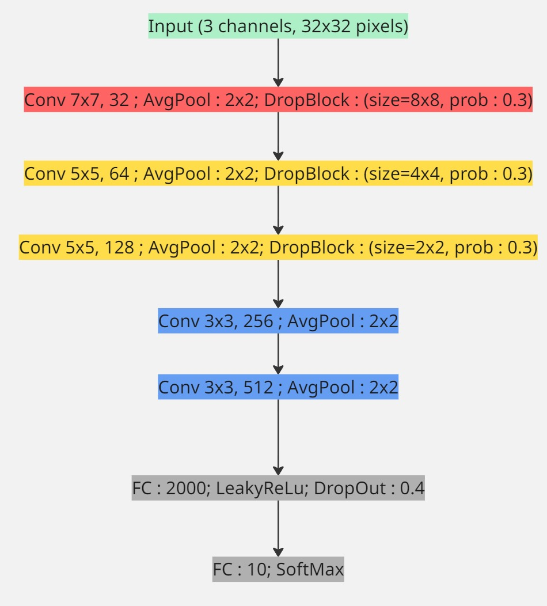
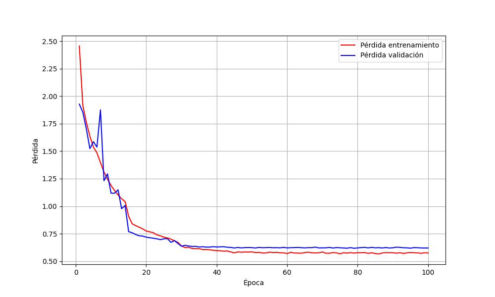
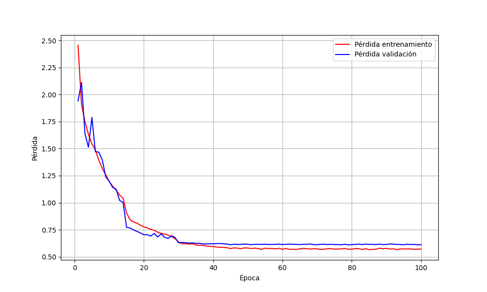
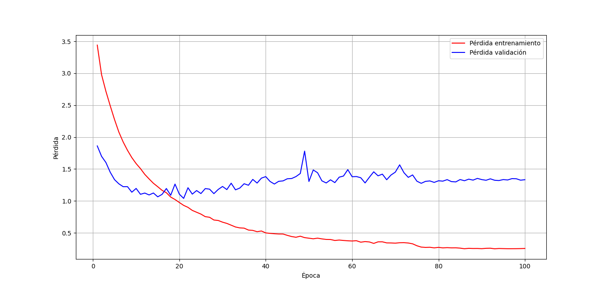
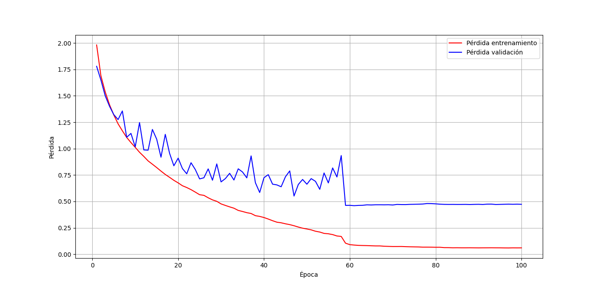
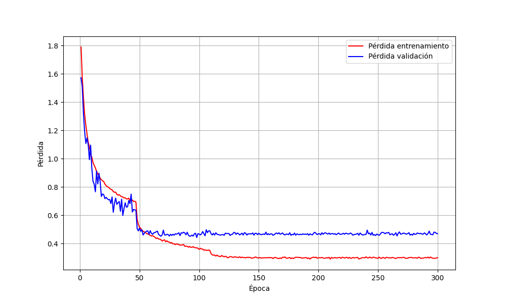

# CIFAR10-CNN-PyTorch

En este proyecto se resolvera el dataset de CIFAR10 utilizando arquitecturas basadas en CNN.


Las **Convolutional Neural Networks** son un tipo de arquitectura de red neuronal que nacen del clasico **Multi Layer Perceptron**, pero que se diferencia por implementar capas de convolucion previas a las capas *fully connected*.

Las capas de convolucion se encargan basicamente de preprocesar los inputs de la red, para hacerlas mas nutritivas en su procesamiento.

La forma en la cual se logra preprocesar los inputs es utilizando justamente convolucion. La convolucion es el nombre que se le da a la operacion de aplicar un filtro sobre una matriz, siendo un filtro otra matriz de pesos aprendibles (en el contexto de los CNNs). La convolucion hace que se destaquen detalles relevantes de los inputs.

La magia de los CNNs (y la razon por la cual la convolucion se incluye dentro de la red) es que, dado que los filtros son matrices de pesos aprendibles, la red aprende a determinar que caracteristicas son mas destacables dentro de los inputs, ajustando los valores de los pesos dentro de los filtros usando backpropagation.


En este ejercicio en concreto, se utilizaran 3 arquitecturas basadas en CNN: plain CNN, Squeeze Excite Net (SENet) e InceptionNet. Luego se compararan sus resultados. Se espera que SENet sea con diferencia la mejor.

Ademas, se implementaran tecnicas de DataAugmentation y Feature Maps Visualization.


# Carga del Dataset

Usando el siguiente codigo, cargamos inicialmente el dataset de entrenamiento y test.

```python

import torchvision.transforms as transforms
from torchvision.datasets import CIFAR10
from torch.utils.data import DataLoader
from utils.MACROS import NUM_WORKERS, BATCH_SIZE


if __name__ == "__main__":

    transform_train = transforms.Compose([
        transforms.ToTensor(),                        # Conversión a tensor
        transforms.Normalize(mean=(0.5, 0.5, 0.5), std=(0.5, 0.5, 0.5))  # Normalización
    ])

    transform_test = transforms.Compose([
        transforms.ToTensor(),
        transforms.Normalize(mean=(0.5, 0.5, 0.5), std=(0.5, 0.5, 0.5))
    ])


    trainset = CIFAR10(root='./data', train=True, download=True, transform=transform_train)
    trainloader = DataLoader(trainset, batch_size=BATCH_SIZE, shuffle=True, num_workers=NUM_WORKERS)

    testset = CIFAR10(root='./data', train=False, download=True, transform=transform_test)
    testloader = DataLoader(testset, batch_size=BATCH_SIZE, shuffle=False, num_workers=NUM_WORKERS)

    for i, (X_batch, Y_batch) in enumerate(trainloader):
        print(X_batch.shape)
        print(Y_batch.shape)

```

Luego, vimos el shape de cada uno de los registros de entrenamiento:


```
torch.Size([128, 3, 32, 32])
torch.Size([128])
```

Cada imagen tiene 3 canales (RGB) y 32 pixeles de ancho y alto. El `Compose` convierte las imagenes retornadas por la clase CIFAR10 en tensores directamente, sin embargo, las podemos visualizar, estas son 3 muestras del conjunto de imagenes.


# Targets y su distribucion

Oficialmente, estas son las clases de cifar10:

| Etiqueta | Clase       | Descripción breve                         |
|---------:|-------------|-------------------------------------------|
| 0        | airplane     | Aviones de todo tipo                     |
| 1        | automobile   | Autos (no incluye camiones)              |
| 2        | bird         | Aves en distintas posiciones             |
| 3        | cat          | Gatos domésticos                         |
| 4        | deer         | Ciervos, venados                         |
| 5        | dog          | Perros de varias razas                   |
| 6        | frog         | Ranas, generalmente en primer plano      |
| 7        | horse        | Caballos                                 |
| 8        | ship         | Barcos, embarcaciones                    |
| 9        | truck        | Camiones, vehículos de carga             |

Para revisar la distribucion de los targets se implemento el siguiente codigo:

```python

    all_labels = pd.Series(torch.cat([y for _, y in trainloader], dim=0))
    print(all_labels.value_counts())
```

Recibimos el siguiente resultado:

```
2    5000
7    5000
3    5000
6    5000
1    5000
4    5000
0    5000
5    5000
8    5000
9    5000
```

# Conjunto de validacion

Usando el siguiente codigo, generamos el conjunto de validacion. Debemos tener en cuenta que el `random_split` de `PyTorch` no garantiza el equilibrio de las clases, en este caso, este es la distribucion de targets para el conjunto de validacion:

```python

import torch
import torchvision.transforms as transforms
from torch.utils.data import random_split
import torchvision.transforms as transforms
from torchvision.datasets import CIFAR10
from torch.utils.data import DataLoader
from utils.MACROS import NUM_WORKERS, BATCH_SIZE
from utils.show_cifar_image import show_tensor_image
import numpy as np
import pandas as pd


if __name__ == "__main__":

    transform_train = transforms.Compose([
        transforms.ToTensor(),                        # Conversión a tensor
        transforms.Normalize(mean=(0.5, 0.5, 0.5), std=(0.5, 0.5, 0.5))  # Normalización
    ])

    transform_test = transforms.Compose([
        transforms.ToTensor(),
        transforms.Normalize(mean=(0.5, 0.5, 0.5), std=(0.5, 0.5, 0.5))
    ])


    trainset = CIFAR10(root='./data', train=True, download=True, transform=transform_train)
    testset = CIFAR10(root='./data', train=False, download=True, transform=transform_test)

    train_size = int(0.8 * len(trainset))
    val_size = len(trainset) - train_size

    torch.manual_seed(42)
    trainset, valset = random_split(trainset, [train_size, val_size])
    valset.dataset.transform = transform_test

    trainloader = DataLoader(trainset, batch_size=BATCH_SIZE, shuffle=True, num_workers=NUM_WORKERS)
    valloader = DataLoader(valset, batch_size=BATCH_SIZE, shuffle=True, num_workers=NUM_WORKERS)
    testloader = DataLoader(testset, batch_size=BATCH_SIZE, shuffle=False, num_workers=NUM_WORKERS)
    labels = pd.Series(torch.concat([y for _,y in valloader], dim=0))
    print(labels.value_counts())


```
Resultado: 

```
7    1035
6    1025
5    1024
1    1010
2    1006
9     999
8     998
0     973
3     967
4     963
```

# Session 1: Primera prueba de entrenamiento

Despues de bastante tiempo moviendo piezas en la construccion de la arquitectura y el proceso de entrenamiento, logramos alcanzar precisiones cercanas al 80% en validacion.

Actualmente la arquitectura es la siguiente:



Este es el codigo:

```python

# PlainCNN.py

from torch import nn
from utils.plain_cnn_block import plain_cnn_block


class PlainCNN(nn.Module):
    def __init__(self, in_channels=3):
        super(PlainCNN, self).__init__()
        self.conv_block1 = plain_cnn_block(in_channels,7,32,3,1, norm=True, pool=2, db=8)
        self.conv_block2 = plain_cnn_block(32,5,64,2,1, norm=True, pool=2, db=4)
        self.conv_block3 = plain_cnn_block(64,5,128,2,1, norm=True, pool=2, db=2)
        self.conv_block4 = plain_cnn_block(128,3,256,1,1, norm=True, pool=2)
        self.conv_block5 = plain_cnn_block(256,3,512,1,1, norm=True, pool=2)
        self.linear_block = nn.Sequential(
                nn.Linear(512, 2000),
                nn.LeakyReLU(),
                nn.Dropout(0.4),
                nn.Linear(2000, 10)
                )
    def forward(self, x):
        out = self.conv_block1(x)
        out = self.conv_block2(out)
        out = self.conv_block3(out)
        out = self.conv_block4(out)
        out = self.conv_block5(out).view(out.size(0), -1)
        out = self.linear_block(out)
        return out

```

```python

# utils/plain_cnn_block.py


from torch import nn
from dropblock import DropBlock2D


def plain_cnn_block(in_channels,kernel_size, out_channels, padding,stride=1, pool=False, norm=False, db=False):
    layers = []
    layers.append(nn.Conv2d(in_channels,out_channels, kernel_size,stride, padding))
    if norm:
        layers.append(nn.BatchNorm2d(out_channels))

    layers.append(nn.ReLU(inplace=True))
    if db:
        layers.append(DropBlock2D(0.3, db))
    if pool:
        layers.append(nn.AvgPool2d(pool))

    return nn.Sequential(*layers)
```

```python

# main.py


import torch
import numpy as np
import time
import torchvision.transforms as transforms
from torch.utils.data import random_split
import torchvision.transforms as transforms
from torchvision.datasets import CIFAR10
from torch.utils.data import DataLoader
from utils.MACROS import NUM_WORKERS, BATCH_SIZE
from utils.PlainCNN import PlainCNN
from utils.plot_performance import plot_performance

if __name__ == "__main__":

    transform_train = transforms.Compose([
        # data augmentation
        transforms.ToTensor(),                        
        transforms.Normalize(mean=(0.5, 0.5, 0.5), std=(0.5, 0.5, 0.5))
    ])

    transform_test = transforms.Compose([
        transforms.ToTensor(),
        transforms.Normalize(mean=(0.5, 0.5, 0.5), std=(0.5, 0.5, 0.5))
    ])


    trainset = CIFAR10(root='./data', train=True, download=True, transform=transform_train)
    testset = CIFAR10(root='./data', train=False, download=True, transform=transform_test)

    train_size = int(0.8 * len(trainset))
    val_size = len(trainset) - train_size

    torch.manual_seed(42)
    trainset, valset = random_split(trainset, [train_size, val_size])
    valset.dataset.transform = transform_test

    trainloader = DataLoader(trainset, batch_size=BATCH_SIZE, shuffle=True, num_workers=NUM_WORKERS, persistent_workers=True)
    valloader = DataLoader(valset, batch_size=BATCH_SIZE, shuffle=False, num_workers=NUM_WORKERS, persistent_workers=True)
    testloader = DataLoader(testset, batch_size=BATCH_SIZE, shuffle=False, num_workers=NUM_WORKERS, persistent_workers=True)

    cnn = PlainCNN(3).to('cuda')

    criterion = torch.nn.CrossEntropyLoss()
    optimizer = torch.optim.Adam(params=cnn.parameters(), lr=1e-2, weight_decay=1e-4)
    epoch_train_loss = []
    epoch_val_loss = []

    for i in range(100):

        train_prec = []
        val_prec = []
        train_loss = []
        val_loss = []

        t1 = time.time()
        cnn.train()

        if (i+1)%15 == 0:
            optimizer.param_groups[0]['lr'] = optimizer.param_groups[0]['lr']*0.1
            print(f"Valor actual del lr : {optimizer.param_groups[0]['lr']}")

        for a, (X_batch, Y_batch) in enumerate(trainloader):
            X_batch, Y_batch = X_batch.to('cuda'), Y_batch.to('cuda')

            optimizer.zero_grad()
            output = cnn(X_batch)
            loss = criterion(output, Y_batch)

            loss.backward()
            optimizer.step()


            # metrics
            _, pred = torch.max(output, 1)
            train_prec.append((pred == Y_batch).cpu().sum() / len(X_batch))
            train_loss.append(loss.item())


        cnn.eval()
        with torch.no_grad():
            for a, (X_batch, Y_batch) in enumerate(valloader):
                X_batch, Y_batch = X_batch.to('cuda'), Y_batch.to('cuda')

                output = cnn(X_batch)
                loss = criterion(output, Y_batch)

                # metrics
                _, pred = torch.max(output, 1)
                val_prec.append((pred == Y_batch).cpu().sum() / len(X_batch))
                val_loss.append(loss.item())


        print(f"""
              Epoch : {i}

                    Train Loss : {np.mean(train_loss):.3f}
                    Train prec : {np.mean(train_prec):.3f}

                    Val loss : {np.mean(val_loss):.3f}
                    Val prec : {np.mean(val_prec):.3f}

                    Time : {time.time()-t1}
              """)
        epoch_train_loss.append(np.mean(train_loss))
        epoch_val_loss.append(np.mean(val_loss))    

    plot_performance(epoch_train_loss, epoch_val_loss)
```

Estos fueron los resultados:


```

              Epoch : 99

                    Train Loss : 0.574
                    Train prec : 0.797

                    Val loss : 0.620
                    Val prec : 0.783

                    Time : 1.5687966346740723
```




En esta sesion implementamos:

* DropBlock
* Dropout
* Weight Decay
* StepLRDecay


# Session 2 : DataAugmentation

Implementando `DataAugmentation` ...

```python

...

if __name__ == "__main__":

    transform_train = transforms.Compose([
        # data augmentation
        transforms.RandomHorizontalFlip(),         # Volteo horizontal aleatorio
        transforms.RandomRotation(15),             # Rotación aleatoria ±15°
        transforms.RandomCrop(32, padding=4),      # Recorte aleatorio con padding
        transforms.ColorJitter(brightness=0.2, contrast=0.2, saturation=0.2),  # Variación de color
        transforms.ToTensor(),                        
        transforms.Normalize(mean=(0.5, 0.5, 0.5), std=(0.5, 0.5, 0.5))
    ])

...
```

Alcanzamos los siguientes resultados:


```
              Epoch : 99

                    Train Loss : 0.572
                    Train prec : 0.801

                    Val loss : 0.613
                    Val prec : 0.790

                    Time : 1.5642516613006592
```




# Session 3: Implementacion de GoogLeNet

Despues de bastante tiempo ajustando la arquitectura de la red, logramos una version muy similar a la del paper de GoogLeNet, utilizando el siguiente codigo:

```python

# utils/InceptionNet.py

import torch
from utils.AuxiliaryClassifier import AuxiliaryClassifier
from torch import nn
from utils.InceptionBlock import InceptionBlock

class InceptionNet(nn.Module):
    def __init__(self, num_classes=10):
        super(InceptionNet, self).__init__()
        
        self.conv_initial = nn.Sequential(
            nn.Conv2d(3, 64, kernel_size=7, stride=2, padding=3),
            nn.BatchNorm2d(64),
            nn.ReLU(inplace=True),
            nn.MaxPool2d(kernel_size=3, stride=2, padding=1),
            nn.Conv2d(64, 192, kernel_size=3, padding=1),
            nn.BatchNorm2d(192),
            nn.ReLU(inplace=True),
            nn.MaxPool2d(kernel_size=3, stride=2, padding=1)
        )
        
        self.inception3a = InceptionBlock(192, 64, 96, 128, 16, 32, 32)
        self.inception3b = InceptionBlock(256, 128, 128, 192, 32, 96, 64)
        
        self.aux1 = AuxiliaryClassifier(in_channels=480, num_classes=num_classes)
        
        self.maxpool4 = nn.MaxPool2d(kernel_size=3, stride=2, padding=1)
        
        self.inception4a = InceptionBlock(480, 192, 96, 208, 16, 48, 64)
        self.inception4b = InceptionBlock(512, 160, 112, 224, 24, 64, 64)
        self.inception4c = InceptionBlock(512, 128, 128, 256, 24, 64, 64)
        self.inception4d = InceptionBlock(512, 112, 144, 288, 32, 64, 64)
        
        self.aux2 = AuxiliaryClassifier(in_channels=528, num_classes=num_classes)
        
        self.inception4e = InceptionBlock(528, 256, 160, 320, 32, 128, 128)
        self.maxpool5 = nn.MaxPool2d(kernel_size=3, stride=2, padding=1)
        
        self.inception5a = InceptionBlock(832, 256, 160, 320, 32, 128, 128)
        self.inception5b = InceptionBlock(832, 384, 192, 384, 48, 128, 128)
        
        self.avgpool = nn.AdaptiveAvgPool2d((1, 1))
        self.dropout = nn.Dropout(p=0.4)
        self.fc = nn.Linear(1024, num_classes) # 1024 es el número de canales de salida del último InceptionBlock 5b
    
    def forward(self, x):
        x = self.conv_initial(x)
        
        x = self.inception3a(x)
        x = self.inception3b(x)
        aux1 = self.aux1(x) 
        
        x = self.maxpool4(x)
        x = self.inception4a(x)
        x = self.inception4b(x)
        x = self.inception4c(x)
        x = self.inception4d(x)
        aux2 = self.aux2(x) 
        
        x = self.inception4e(x)
        x = self.maxpool5(x)
        x = self.inception5a(x)
        x = self.inception5b(x)
        x = self.avgpool(x)
        x = torch.flatten(x, 1)
        x = self.dropout(x)
        x = self.fc(x)
        
        return x, aux1, aux2


# utils/InceptionBlock.py

from torch import nn
import torch
from dropblock import DropBlock2D

class InceptionBlock(nn.Module):
    def __init__(self,  in_channels, out_1x1, red_3x3, out_3x3, red_5x5, out_5x5, pool_proj):
        super(InceptionBlock, self).__init__()
        self.branch1 = nn.Sequential(
                nn.Conv2d(in_channels, out_channels=out_1x1, kernel_size=1, padding=0, stride=1)
                )
        self.branch2 = nn.Sequential(
                nn.Conv2d(in_channels, red_3x3, kernel_size=1, padding=0, stride=1),
                nn.ReLU(),
                nn.BatchNorm2d(red_3x3),
                nn.Conv2d(red_3x3, out_3x3, kernel_size=3, padding=1, stride=1),
                nn.BatchNorm2d(out_3x3),
                nn.ReLU()
                )
        self.branch3 = nn.Sequential(
                nn.Conv2d(in_channels, red_5x5, kernel_size=1, padding=0, stride=1),
                nn.ReLU(),
                nn.BatchNorm2d(red_5x5),
                nn.Conv2d(red_5x5, out_5x5, kernel_size=5, padding=2, stride=1),
                nn.BatchNorm2d(out_5x5),
                nn.ReLU()
                )
        self.branch4 = nn.Sequential(
                nn.MaxPool2d(kernel_size=3, stride=1, padding=1),
                nn.ReLU(),
                nn.BatchNorm2d(in_channels),
                nn.Conv2d(in_channels, pool_proj, kernel_size=1, padding=0, stride=1),
                nn.BatchNorm2d(pool_proj),
                nn.ReLU()
                )
#        self.drop_block = nn.Dropout2d()

    def forward(self, X):
        conv1 = self.branch1(X)
        conv2 = self.branch2(X)
        conv3 = self.branch3(X)
        conv4 = self.branch4(X)
        concat = torch.cat([conv1, conv2, conv3, conv4], dim=1)
        return concat

# utils/AuxiliaryClassifier.py

import torch.nn as nn

class AuxiliaryClassifier(nn.Module):
    def __init__(self, in_channels, num_classes):
        super(AuxiliaryClassifier, self).__init__()
        # Capas del clasificador auxiliar basadas en la arquitectura original de GoogLeNet
        self.auxiliary = nn.Sequential(
            nn.AvgPool2d(kernel_size=1, stride=1), 
            nn.Conv2d(in_channels, 128, kernel_size=1),
            nn.BatchNorm2d(128),
            nn.ReLU(inplace=True),
            nn.AdaptiveAvgPool2d((1,1)),
        )
        self.linear = nn.Sequential(
            nn.Linear(128, 1024),
            nn.ReLU(inplace=True),
            nn.Dropout(p=0.6),
            nn.Linear(1024, num_classes)
                )

    def forward(self, x):
        x = self.auxiliary(x)
        x = x.view(x.size(0), -1)
        return self.linear(x)


# main.py

import torch
from torch.optim.lr_scheduler import ReduceLROnPlateau
import numpy as np
import time
import torchvision.transforms as transforms
from torch.utils.data import random_split
import torchvision.transforms as transforms
from torchvision.datasets import CIFAR10
from torch.utils.data import DataLoader
from utils.MACROS import NUM_WORKERS, BATCH_SIZE
from utils.PlainCNN import PlainCNN
from utils.InceptionNet import InceptionNet
from utils.plot_performance import plot_performance

if __name__ == "__main__":

    transform_train = transforms.Compose([
        # data augmentation
        transforms.RandomHorizontalFlip(),         # Volteo horizontal aleatorio
        transforms.RandomRotation(15),             # Rotación aleatoria ±15°
        transforms.RandomCrop(32, padding=4),      # Recorte aleatorio con padding
        transforms.ColorJitter(brightness=0.2, contrast=0.2, saturation=0.2),  # Variación de color
        transforms.ToTensor(),                        
        transforms.Normalize(mean=(0.5, 0.5, 0.5), std=(0.5, 0.5, 0.5))
    ])

    transform_test = transforms.Compose([
        transforms.ToTensor(),
        transforms.Normalize(mean=(0.5, 0.5, 0.5), std=(0.5, 0.5, 0.5))
    ])


    trainset = CIFAR10(root='./data', train=True, download=True, transform=transform_train)
    testset = CIFAR10(root='./data', train=False, download=True, transform=transform_test)

    train_size = int(0.8 * len(trainset))
    val_size = len(trainset) - train_size

    torch.manual_seed(42)
    trainset, valset = random_split(trainset, [train_size, val_size])
    valset.dataset.transform = transform_test

    trainloader = DataLoader(trainset, batch_size=BATCH_SIZE, shuffle=True, num_workers=NUM_WORKERS, persistent_workers=True)
    valloader = DataLoader(valset, batch_size=BATCH_SIZE, shuffle=False, num_workers=NUM_WORKERS, persistent_workers=True)
    testloader = DataLoader(testset, batch_size=BATCH_SIZE, shuffle=False, num_workers=NUM_WORKERS, persistent_workers=True)

    inception = InceptionNet().to('cuda')

    criterion = torch.nn.CrossEntropyLoss()
    optimizer = torch.optim.Adam(params=inception.parameters(), lr=1e-4, weight_decay=1e-4)
    scheduler = ReduceLROnPlateau(optimizer, mode='min', factor=0.1, patience=10)
    epoch_train_loss = []
    epoch_val_loss = []

    for i in range(100):

        train_prec = []
        val_prec = []
        train_loss = []
        val_loss = []

        t1 = time.time()
        inception.train()

        for a, (X_batch, Y_batch) in enumerate(trainloader):
            X_batch, Y_batch = X_batch.to('cuda'), Y_batch.to('cuda')

            optimizer.zero_grad()
            output, aux1, aux2 = inception(X_batch)
            loss = criterion(output, Y_batch)
            aux_loss1 = criterion(aux1, Y_batch)
            aux_loss2 = criterion(aux2, Y_batch)

            total_loss = loss + 0.3 * aux_loss1 + 0.3 * aux_loss2

            total_loss.backward()
            optimizer.step()

            # metrics
            _, pred = torch.max(output, 1)
            train_prec.append((pred == Y_batch).cpu().sum() / len(X_batch))
            train_loss.append(total_loss.item())


        inception.eval()
        with torch.no_grad():
            for a, (X_batch, Y_batch) in enumerate(valloader):
                X_batch, Y_batch = X_batch.to('cuda'), Y_batch.to('cuda')

                output,_, _ = inception(X_batch)
                loss = criterion(output, Y_batch)

                # metrics
                _, pred = torch.max(output, 1)
                val_prec.append((pred == Y_batch).cpu().sum() / len(X_batch))
                val_loss.append(loss.item())

        scheduler.step(np.mean(val_loss))
        


        print(f"""
              Epoch : {i+1}

                    Train Loss : {np.mean(train_loss):.3f}
                    Train prec : {np.mean(train_prec):.3f}

                    Val loss : {np.mean(val_loss):.3f}
                    Val prec : {np.mean(val_prec):.3f}

                    Time : {time.time()-t1}
              """)
        epoch_train_loss.append(np.mean(train_loss))
        epoch_val_loss.append(np.mean(val_loss))

    plot_performance(epoch_train_loss, epoch_val_loss)
```


Estos son los resultados:

```
              Epoch : 24

                    Train Loss : 0.341
                    Train prec : 0.999

                    Val loss : 2.135
                    Val prec : 0.548

                    Time : 2.8497347831726074
```

El entrenamiento se estanca. Al ser una arquitectura tan profunda, el overfitting es dificil de controlar.


# Session 4: Intento de mejora de precisiones

Luego de utilizar las siguientes tecnicas:

* Adam -> SGD with momentum
* Cambios en normalizacion y data augmentation
* DropBlock
* Batch size 512 -> 128

Se alcanzaron los siguientes resultados:

```
              Epoch : 100

                    Train Loss : 0.255
                    Train prec : 0.926

                    Val loss : 1.333
                    Val prec : 0.707

                    Time : 5.9890525341033936
```



Mi analisis de la situacion es que la red es demasiado profunda para la complejidad del problema, eso ocasiona un overfitting muy dificil de manejar.

# Session 5: Implementacion de SqueezeExciteNet

Utilizando el siguiente codigo:


```python

# utils/SEBlock.py

from typing import final
from torch import nn


class SEBlock(nn.Module):
    def __init__(self, out_channels) -> None:
        super(SEBlock, self).__init__()
        self.linear_layer = nn.Sequential(
                nn.AdaptiveAvgPool2d((1,1)),
                nn.Flatten(),
                nn.Linear(out_channels, 1000),
                nn.ReLU(),
                nn.Linear(1000, out_channels),
                nn.Sigmoid()
                )
    
    def forward(self, x):
        linear_out = self.linear_layer(x) #  -> [B, out_channels]
        linear_out = linear_out.unsqueeze(-1).unsqueeze(-1)
        return x*linear_out

```

```python
# utils/SENet.py

from torch import nn

from utils.SEBlock import SEBlock


class SENet(nn.Module):
    def __init__(self) -> None:
        super(SENet, self).__init__()
        self.se_blocks = nn.Sequential(
            nn.Conv2d(3, 64, 7, 1, 3),
            nn.BatchNorm2d(64),
            nn.ReLU(),
            SEBlock(64),
            nn.Conv2d(64, 108, 5, 1, 2),
            nn.BatchNorm2d(108),
            nn.ReLU(),
            SEBlock(108),
            nn.Conv2d(108, 186, 5, 1, 2),
            nn.BatchNorm2d(186),
            nn.ReLU(),
            SEBlock(186),
            nn.Conv2d(186, 230, 3, 1, 1),
            nn.BatchNorm2d(230),
            nn.ReLU(),
            SEBlock(230),
            nn.Conv2d(230, 300, 3, 1, 1),
            nn.BatchNorm2d(300),
            nn.ReLU(),
                )
        self.pool = nn.AdaptiveAvgPool2d((1,1))
        self.linear_layers = nn.Sequential(
                nn.Linear(300, 10)
                )
    def forward(self, x):
        out = self.se_blocks(x)
        out = self.pool(out)
        out = out.view(out.size(0), -1)
        return self.linear_layers(out)
```

```python

import torch
from torch.optim.lr_scheduler import ReduceLROnPlateau
import numpy as np
import time
import torchvision.transforms as transforms
from torch.utils.data import random_split
import torchvision.transforms as transforms
from torchvision.datasets import CIFAR10
from torch.utils.data import DataLoader
from utils.MACROS import NUM_WORKERS, BATCH_SIZE
from utils.PlainCNN import PlainCNN
from utils.SENet import SENet
from utils.plot_performance import plot_performance

if __name__ == "__main__":

    transform_train = transforms.Compose([
        transforms.RandomHorizontalFlip(),
        transforms.RandomRotation(15),
        transforms.RandomCrop(32, padding=4),
        transforms.ColorJitter(brightness=0.2, contrast=0.2, saturation=0.2),
        transforms.ToTensor(),
        transforms.Normalize([0.4914, 0.4822, 0.4465], [0.2023, 0.1994, 0.2010]),
        transforms.RandomErasing(p=0.5, scale=(0.02, 0.1), ratio=(0.3, 3.3)) 
    ])

    transform_test = transforms.Compose([
        transforms.ToTensor(),
        transforms.Normalize(mean=[0.4914, 0.4822, 0.4465], std=[0.2023, 0.1994, 0.2010])
    ])


    trainset = CIFAR10(root='./data', train=True, download=True, transform=transform_train)
    testset = CIFAR10(root='./data', train=False, download=True, transform=transform_test)

    train_size = int(0.8 * len(trainset))
    val_size = len(trainset) - train_size

    torch.manual_seed(42)
    trainset, valset = random_split(trainset, [train_size, val_size])
    valset.dataset.transform = transform_test

    trainloader = DataLoader(trainset, batch_size=BATCH_SIZE, shuffle=True, num_workers=NUM_WORKERS, persistent_workers=True)
    valloader = DataLoader(valset, batch_size=BATCH_SIZE, shuffle=False, num_workers=NUM_WORKERS, persistent_workers=True)
    testloader = DataLoader(testset, batch_size=BATCH_SIZE, shuffle=False, num_workers=NUM_WORKERS, persistent_workers=True)

    se_net = SENet().to('cuda')

    criterion = torch.nn.CrossEntropyLoss()
    optimizer = torch.optim.SGD(params=se_net.parameters(), lr=0.001, weight_decay=5e-4, momentum=0.9)
    scheduler = ReduceLROnPlateau(optimizer, mode='max', factor=0.1, patience=10)
    epoch_train_loss = []
    epoch_val_loss = []

    for i in range(100):

        train_prec = []
        val_prec = []
        train_loss = []
        val_loss = []

        t1 = time.time()
        se_net.train()

        for a, (X_batch, Y_batch) in enumerate(trainloader):
            X_batch, Y_batch = X_batch.to('cuda'), Y_batch.to('cuda')

            optimizer.zero_grad()
            output = se_net(X_batch)
            loss = criterion(output, Y_batch)

            loss.backward()
            optimizer.step()

            # metrics
            _, pred = torch.max(output, 1)
            train_prec.append((pred == Y_batch).cpu().sum() / len(X_batch))
            train_loss.append(loss.item())


        se_net.eval()
        with torch.no_grad():
            for a, (X_batch, Y_batch) in enumerate(valloader):
                X_batch, Y_batch = X_batch.to('cuda'), Y_batch.to('cuda')

                output = se_net(X_batch)
                loss = criterion(output, Y_batch)

                # metrics
                _, pred = torch.max(output, 1)
                val_prec.append((pred == Y_batch).cpu().sum() / len(X_batch))
                val_loss.append(loss.item())

        scheduler.step(np.mean(val_prec))
        


        print(f"""
              Epoch : {i+1}

                    Train Loss : {np.mean(train_loss):.3f}
                    Train prec : {np.mean(train_prec):.3f}

                    Val loss : {np.mean(val_loss):.3f}
                    Val prec : {np.mean(val_prec):.3f}

                    Time : {time.time()-t1}
              """)
        epoch_train_loss.append(np.mean(train_loss))
        epoch_val_loss.append(np.mean(val_loss))

    plot_performance(epoch_train_loss, epoch_val_loss)
```

Se obtuvieron los siguientes resultados:

```
              Epoch : 100

                    Train Loss : 0.060
                    Train prec : 0.996

                    Val loss : 0.473
                    Val prec : 0.846

                    Time : 23.089218378067017
```



Se comporta mucho mejor que GoogLeNet, pero mucho mas lento, se implementaran tecnicas de regularizacion.

# Session 6: Mejora de SENet

Se realizaron los siguientes cambios:

* Implementacion de dropblock
* Extencion de capas lineales
* Implementacion de average pooling
* Implementacion de reduction factor en SEBlock
* Implementacion de Adam
* Reduccion del batch

Utilizando el siguiente codigo:

```python

# main.py

import torch
from torch.optim.lr_scheduler import ReduceLROnPlateau
import numpy as np
import time
import torchvision.transforms as transforms
from torch.utils.data import random_split
import torchvision.transforms as transforms
from torchvision.datasets import CIFAR10
from torch.utils.data import DataLoader
from utils.MACROS import NUM_WORKERS, BATCH_SIZE
from utils.PlainCNN import PlainCNN
from utils.SENet import SENet
from utils.plot_performance import plot_performance

if __name__ == "__main__":

    transform_train = transforms.Compose([
        transforms.RandomHorizontalFlip(),
        transforms.RandomRotation(15),
        transforms.RandomCrop(32, padding=4),
        transforms.ColorJitter(brightness=0.2, contrast=0.2, saturation=0.2),
        transforms.ToTensor(),
        transforms.Normalize([0.4914, 0.4822, 0.4465], [0.2023, 0.1994, 0.2010]),
        transforms.RandomErasing(p=0.5, scale=(0.02, 0.1), ratio=(0.3, 3.3))
    ])

    transform_test = transforms.Compose([
        transforms.ToTensor(),
        transforms.Normalize(mean=[0.4914, 0.4822, 0.4465], std=[0.2023, 0.1994, 0.2010])
    ])


    trainset = CIFAR10(root='./data', train=True, download=True, transform=transform_train)
    testset = CIFAR10(root='./data', train=False, download=True, transform=transform_test)

    train_size = int(0.8 * len(trainset))
    val_size = len(trainset) - train_size

    torch.manual_seed(42)
    trainset, valset = random_split(trainset, [train_size, val_size])
    valset.dataset.transform = transform_test

    trainloader = DataLoader(trainset, batch_size=BATCH_SIZE, shuffle=True, num_workers=NUM_WORKERS, persistent_workers=True)
    valloader = DataLoader(valset, batch_size=BATCH_SIZE, shuffle=False, num_workers=NUM_WORKERS, persistent_workers=True)
    testloader = DataLoader(testset, batch_size=BATCH_SIZE, shuffle=False, num_workers=NUM_WORKERS, persistent_workers=True)

    se_net = SENet().to('cuda')

    criterion = torch.nn.CrossEntropyLoss()
    optimizer = torch.optim.Adam(params=se_net.parameters(), lr=0.001, weight_decay=5e-4)
    scheduler = ReduceLROnPlateau(optimizer, mode='max', factor=0.1, patience=10)
    epoch_train_loss = []
    epoch_val_loss = []

    for i in range(300):

        train_prec = []
        val_prec = []
        train_loss = []
        val_loss = []

        t1 = time.time()
        se_net.train()

        for a, (X_batch, Y_batch) in enumerate(trainloader):
            X_batch, Y_batch = X_batch.to('cuda'), Y_batch.to('cuda')

            optimizer.zero_grad()
            output = se_net(X_batch)
            loss = criterion(output, Y_batch)

            loss.backward()
            optimizer.step()

            # metrics
            _, pred = torch.max(output, 1)
            train_prec.append((pred == Y_batch).cpu().sum() / len(X_batch))
            train_loss.append(loss.item())


        se_net.eval()
        with torch.no_grad():
            for a, (X_batch, Y_batch) in enumerate(valloader):
                X_batch, Y_batch = X_batch.to('cuda'), Y_batch.to('cuda')

                output = se_net(X_batch)
                loss = criterion(output, Y_batch)

                # metrics
                _, pred = torch.max(output, 1)
                val_prec.append((pred == Y_batch).cpu().sum() / len(X_batch))
                val_loss.append(loss.item())

        scheduler.step(np.mean(val_prec))


        print(f"""
              Epoch : {i+1}

                    Train Loss : {np.mean(train_loss):.3f}
                    Train prec : {np.mean(train_prec):.3f}

                    Val loss : {np.mean(val_loss):.3f}
                    Val prec : {np.mean(val_prec):.3f}

                    Time : {time.time()-t1}
              """)
        epoch_train_loss.append(np.mean(train_loss))
        epoch_val_loss.append(np.mean(val_loss))

    plot_performance(epoch_train_loss, epoch_val_loss)
```

```python

# utils/SEBlock.py


from typing import final
from torch import nn


class SEBlock(nn.Module):
    def __init__(self, out_channels, reduction) -> None:
        super(SEBlock, self).__init__()
        self.linear_layer = nn.Sequential(
                nn.AdaptiveAvgPool2d((1,1)),
                nn.Flatten(),
                nn.Linear(out_channels, int(out_channels // reduction)),
                nn.ReLU(),
                nn.Linear(int(out_channels // reduction), out_channels),
                nn.Sigmoid()
                )

    def forward(self, x):
        linear_out = self.linear_layer(x) #  -> [B, out_channels]
        linear_out = linear_out.unsqueeze(-1).unsqueeze(-1)
        return x*linear_out


```


```python

from torch import nn

from utils.SEBlock import SEBlock
from dropblock import DropBlock2D


class SENet(nn.Module):
    def __init__(self) -> None:
        super(SENet, self).__init__()
        self.se_blocks = nn.Sequential(

            nn.Conv2d(3, 64, 7, 1, 3),
            nn.BatchNorm2d(64),
            nn.ReLU(),
            SEBlock(64, 8),
            nn.AvgPool2d(2),
            DropBlock2D(0.35, 4),

            nn.Conv2d(64, 96, 5, 1, 2),
            nn.BatchNorm2d(96),
            nn.ReLU(),
            SEBlock(96, 12),

            nn.Conv2d(96, 144, 5, 1, 2),
            nn.BatchNorm2d(144),
            nn.ReLU(),
            SEBlock(144, 16),
            nn.AvgPool2d(2),
            DropBlock2D(0.6, 2),

            nn.Conv2d(144, 192, 3, 1, 1),
            nn.BatchNorm2d(192),
            nn.ReLU(),
            SEBlock(192, 16),

            nn.Conv2d(192, 272, 3, 1, 1),
            nn.BatchNorm2d(272),
            nn.ReLU(),
            SEBlock(272, 32),
            nn.AvgPool2d(2),
            DropBlock2D(0.35, 1),
                )
        self.pool = nn.AdaptiveAvgPool2d((1,1))
        self.linear_layers = nn.Sequential(
                nn.Linear(272, 1000),
                nn.ReLU(),
                nn.Dropout(0.6),
                nn.Linear(1000, 10)
                )
    def forward(self, x):
        out = self.se_blocks(x)
        out = self.pool(out)
        out = out.view(out.size(0), -1)
        return self.linear_layers(out)
```

Se lograron los siguientes resultados:


```

              Epoch : 300

                    Train Loss : 0.301
                    Train prec : 0.898

                    Val loss : 0.470
                    Val prec : 0.854

                    Time : 4.3205554485321045
```


