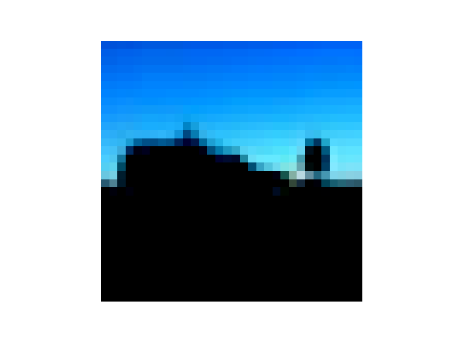
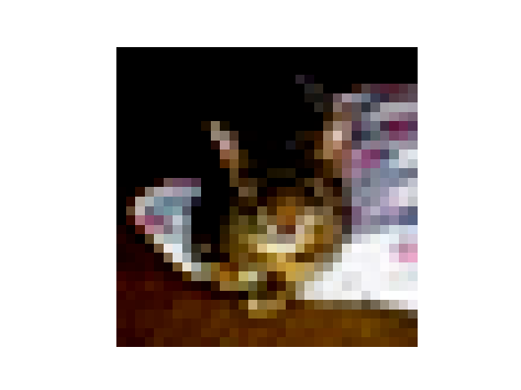
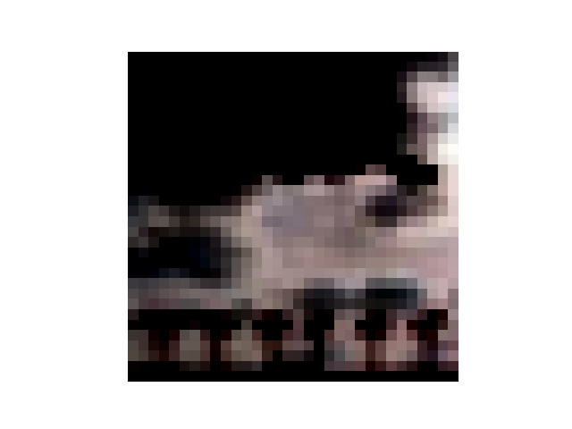

# CIFAR10-CNN-PyTorch

En este proyecto se resolvera el dataset de CIFAR10 utilizando arquitecturas basadas en CNN.


Las **Convolutional Neural Networks** son un tipo de arquitectura de red neuronal que nacen del clasico **Multi Layer Perceptron**, pero que se diferencia por implementar capas de convolucion previas a las capas *fully connected*.

Las capas de convolucion se encargan basicamente de preprocesar los inputs de la red, para hacerlas mas nutritivas en su procesamiento.

La forma en la cual se logra preprocesar los inputs es utilizando justamente convolucion. La convolucion es el nombre que se le da a la operacion de aplicar un filtro sobre una matriz, siendo un filtro otra matriz de pesos aprendibles (en el contexto de los CNNs). La convolucion hace que se destaquen detalles relevantes de los inputs.

La magia de los CNNs (y la razon por la cual la convolucion se incluye dentro de la red) es que, dado que los filtros son matrices de pesos aprendibles, la red aprende a determinar que caracteristicas son mas destacables dentro de los inputs, ajustando los valores de los pesos dentro de los filtros usando backpropagation.


En este ejercicio en concreto, se utilizaran 3 arquitecturas basadas en CNN: plain CNN, Squeeze Excite Net (SENet) e InceptionNet. Luego se compararan sus resultados. Se espera que SENet sea con diferencia la mejor.

Ademas, se implementaran tecnicas de DataAugmentation y Feature Maps Visualization.


# Carga del Dataset

Usando el siguiente codigo, cargamos inicialmente el dataset de entrenamiento y test.

```python

import torchvision.transforms as transforms
from torchvision.datasets import CIFAR10
from torch.utils.data import DataLoader
from utils.MACROS import NUM_WORKERS, BATCH_SIZE


if __name__ == "__main__":

    transform_train = transforms.Compose([
        transforms.ToTensor(),                        # Conversión a tensor
        transforms.Normalize(mean=(0.5, 0.5, 0.5), std=(0.5, 0.5, 0.5))  # Normalización
    ])

    transform_test = transforms.Compose([
        transforms.ToTensor(),
        transforms.Normalize(mean=(0.5, 0.5, 0.5), std=(0.5, 0.5, 0.5))
    ])


    trainset = CIFAR10(root='./data', train=True, download=True, transform=transform_train)
    trainloader = DataLoader(trainset, batch_size=BATCH_SIZE, shuffle=True, num_workers=NUM_WORKERS)

    testset = CIFAR10(root='./data', train=False, download=True, transform=transform_test)
    testloader = DataLoader(testset, batch_size=BATCH_SIZE, shuffle=False, num_workers=NUM_WORKERS)

    for i, (X_batch, Y_batch) in enumerate(trainloader):
        print(X_batch.shape)
        print(Y_batch.shape)

```

Luego, vimos el shape de cada uno de los registros de entrenamiento:


```
torch.Size([128, 3, 32, 32])
torch.Size([128])
```

Cada imagen tiene 3 canales (RGB) y 32 pixeles de ancho y alto. El `Compose` convierte las imagenes retornadas por la clase CIFAR10 en tensores directamente, sin embargo, las podemos visualizar, estas son 3 muestras del conjunto de imagenes.





