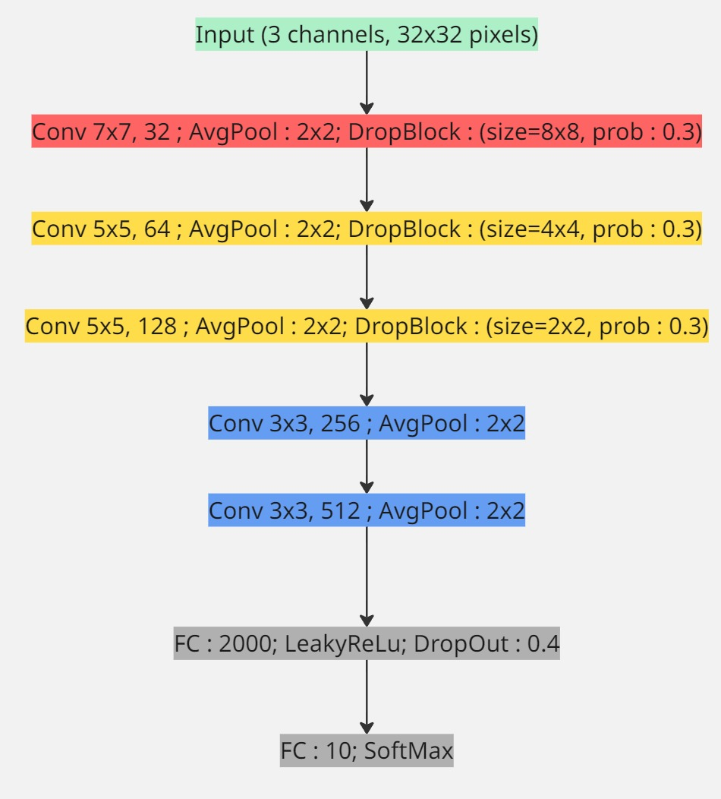
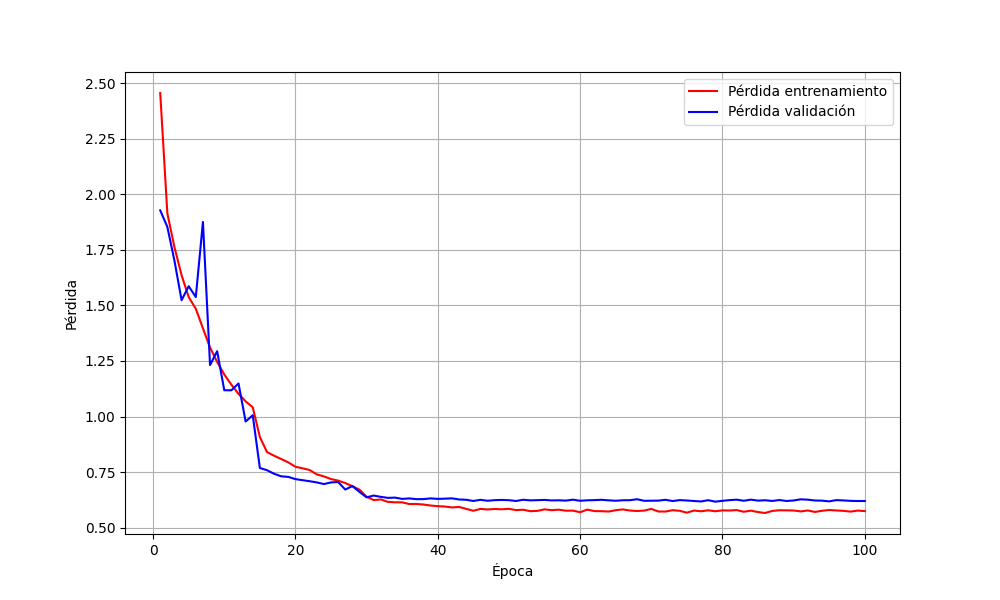

# CIFAR10-CNN-PyTorch

En este proyecto se resolvera el dataset de CIFAR10 utilizando arquitecturas basadas en CNN.


Las **Convolutional Neural Networks** son un tipo de arquitectura de red neuronal que nacen del clasico **Multi Layer Perceptron**, pero que se diferencia por implementar capas de convolucion previas a las capas *fully connected*.

Las capas de convolucion se encargan basicamente de preprocesar los inputs de la red, para hacerlas mas nutritivas en su procesamiento.

La forma en la cual se logra preprocesar los inputs es utilizando justamente convolucion. La convolucion es el nombre que se le da a la operacion de aplicar un filtro sobre una matriz, siendo un filtro otra matriz de pesos aprendibles (en el contexto de los CNNs). La convolucion hace que se destaquen detalles relevantes de los inputs.

La magia de los CNNs (y la razon por la cual la convolucion se incluye dentro de la red) es que, dado que los filtros son matrices de pesos aprendibles, la red aprende a determinar que caracteristicas son mas destacables dentro de los inputs, ajustando los valores de los pesos dentro de los filtros usando backpropagation.


En este ejercicio en concreto, se utilizaran 3 arquitecturas basadas en CNN: plain CNN, Squeeze Excite Net (SENet) e InceptionNet. Luego se compararan sus resultados. Se espera que SENet sea con diferencia la mejor.

Ademas, se implementaran tecnicas de DataAugmentation y Feature Maps Visualization.


# Carga del Dataset

Usando el siguiente codigo, cargamos inicialmente el dataset de entrenamiento y test.

```python

import torchvision.transforms as transforms
from torchvision.datasets import CIFAR10
from torch.utils.data import DataLoader
from utils.MACROS import NUM_WORKERS, BATCH_SIZE


if __name__ == "__main__":

    transform_train = transforms.Compose([
        transforms.ToTensor(),                        # Conversión a tensor
        transforms.Normalize(mean=(0.5, 0.5, 0.5), std=(0.5, 0.5, 0.5))  # Normalización
    ])

    transform_test = transforms.Compose([
        transforms.ToTensor(),
        transforms.Normalize(mean=(0.5, 0.5, 0.5), std=(0.5, 0.5, 0.5))
    ])


    trainset = CIFAR10(root='./data', train=True, download=True, transform=transform_train)
    trainloader = DataLoader(trainset, batch_size=BATCH_SIZE, shuffle=True, num_workers=NUM_WORKERS)

    testset = CIFAR10(root='./data', train=False, download=True, transform=transform_test)
    testloader = DataLoader(testset, batch_size=BATCH_SIZE, shuffle=False, num_workers=NUM_WORKERS)

    for i, (X_batch, Y_batch) in enumerate(trainloader):
        print(X_batch.shape)
        print(Y_batch.shape)

```

Luego, vimos el shape de cada uno de los registros de entrenamiento:


```
torch.Size([128, 3, 32, 32])
torch.Size([128])
```

Cada imagen tiene 3 canales (RGB) y 32 pixeles de ancho y alto. El `Compose` convierte las imagenes retornadas por la clase CIFAR10 en tensores directamente, sin embargo, las podemos visualizar, estas son 3 muestras del conjunto de imagenes.


# Targets y su distribucion

Oficialmente, estas son las clases de cifar10:

| Etiqueta | Clase       | Descripción breve                         |
|---------:|-------------|-------------------------------------------|
| 0        | airplane     | Aviones de todo tipo                     |
| 1        | automobile   | Autos (no incluye camiones)              |
| 2        | bird         | Aves en distintas posiciones             |
| 3        | cat          | Gatos domésticos                         |
| 4        | deer         | Ciervos, venados                         |
| 5        | dog          | Perros de varias razas                   |
| 6        | frog         | Ranas, generalmente en primer plano      |
| 7        | horse        | Caballos                                 |
| 8        | ship         | Barcos, embarcaciones                    |
| 9        | truck        | Camiones, vehículos de carga             |

Para revisar la distribucion de los targets se implemento el siguiente codigo:

```python

    all_labels = pd.Series(torch.cat([y for _, y in trainloader], dim=0))
    print(all_labels.value_counts())
```

Recibimos el siguiente resultado:

```
2    5000
7    5000
3    5000
6    5000
1    5000
4    5000
0    5000
5    5000
8    5000
9    5000
```

# Conjunto de validacion

Usando el siguiente codigo, generamos el conjunto de validacion. Debemos tener en cuenta que el `random_split` de `PyTorch` no garantiza el equilibrio de las clases, en este caso, este es la distribucion de targets para el conjunto de validacion:

```python

import torch
import torchvision.transforms as transforms
from torch.utils.data import random_split
import torchvision.transforms as transforms
from torchvision.datasets import CIFAR10
from torch.utils.data import DataLoader
from utils.MACROS import NUM_WORKERS, BATCH_SIZE
from utils.show_cifar_image import show_tensor_image
import numpy as np
import pandas as pd


if __name__ == "__main__":

    transform_train = transforms.Compose([
        transforms.ToTensor(),                        # Conversión a tensor
        transforms.Normalize(mean=(0.5, 0.5, 0.5), std=(0.5, 0.5, 0.5))  # Normalización
    ])

    transform_test = transforms.Compose([
        transforms.ToTensor(),
        transforms.Normalize(mean=(0.5, 0.5, 0.5), std=(0.5, 0.5, 0.5))
    ])


    trainset = CIFAR10(root='./data', train=True, download=True, transform=transform_train)
    testset = CIFAR10(root='./data', train=False, download=True, transform=transform_test)

    train_size = int(0.8 * len(trainset))
    val_size = len(trainset) - train_size

    torch.manual_seed(42)
    trainset, valset = random_split(trainset, [train_size, val_size])
    valset.dataset.transform = transform_test

    trainloader = DataLoader(trainset, batch_size=BATCH_SIZE, shuffle=True, num_workers=NUM_WORKERS)
    valloader = DataLoader(valset, batch_size=BATCH_SIZE, shuffle=True, num_workers=NUM_WORKERS)
    testloader = DataLoader(testset, batch_size=BATCH_SIZE, shuffle=False, num_workers=NUM_WORKERS)
    labels = pd.Series(torch.concat([y for _,y in valloader], dim=0))
    print(labels.value_counts())


```
Resultado: 

```
7    1035
6    1025
5    1024
1    1010
2    1006
9     999
8     998
0     973
3     967
4     963
```

# Primera prueba de entrenamiento

Despues de bastante tiempo moviendo piezas en la construccion de la arquitectura y el proceso de entrenamiento, logramos alcanzar precisiones cercanas al 80% en validacion.

Actualmente la arquitectura es la siguiente:



Este es el codigo:

```python

# PlainCNN.py

from torch import nn
from utils.plain_cnn_block import plain_cnn_block


class PlainCNN(nn.Module):
    def __init__(self, in_channels=3):
        super(PlainCNN, self).__init__()
        self.conv_block1 = plain_cnn_block(in_channels,7,32,3,1, norm=True, pool=2, db=8)
        self.conv_block2 = plain_cnn_block(32,5,64,2,1, norm=True, pool=2, db=4)
        self.conv_block3 = plain_cnn_block(64,5,128,2,1, norm=True, pool=2, db=2)
        self.conv_block4 = plain_cnn_block(128,3,256,1,1, norm=True, pool=2)
        self.conv_block5 = plain_cnn_block(256,3,512,1,1, norm=True, pool=2)
        self.linear_block = nn.Sequential(
                nn.Linear(512, 2000),
                nn.LeakyReLU(),
                nn.Dropout(0.4),
                nn.Linear(2000, 10)
                )
    def forward(self, x):
        out = self.conv_block1(x)
        out = self.conv_block2(out)
        out = self.conv_block3(out)
        out = self.conv_block4(out)
        out = self.conv_block5(out).view(out.size(0), -1)
        out = self.linear_block(out)
        return out

```

```python

# utils/plain_cnn_block.py


from torch import nn
from dropblock import DropBlock2D


def plain_cnn_block(in_channels,kernel_size, out_channels, padding,stride=1, pool=False, norm=False, db=False):
    layers = []
    layers.append(nn.Conv2d(in_channels,out_channels, kernel_size,stride, padding))
    if norm:
        layers.append(nn.BatchNorm2d(out_channels))

    layers.append(nn.ReLU(inplace=True))
    if db:
        layers.append(DropBlock2D(0.3, db))
    if pool:
        layers.append(nn.AvgPool2d(pool))

    return nn.Sequential(*layers)
```

```python

# main.py


import torch
import numpy as np
import time
import torchvision.transforms as transforms
from torch.utils.data import random_split
import torchvision.transforms as transforms
from torchvision.datasets import CIFAR10
from torch.utils.data import DataLoader
from utils.MACROS import NUM_WORKERS, BATCH_SIZE
from utils.PlainCNN import PlainCNN
from utils.plot_performance import plot_performance

if __name__ == "__main__":

    transform_train = transforms.Compose([
        # data augmentation
        transforms.ToTensor(),                        
        transforms.Normalize(mean=(0.5, 0.5, 0.5), std=(0.5, 0.5, 0.5))
    ])

    transform_test = transforms.Compose([
        transforms.ToTensor(),
        transforms.Normalize(mean=(0.5, 0.5, 0.5), std=(0.5, 0.5, 0.5))
    ])


    trainset = CIFAR10(root='./data', train=True, download=True, transform=transform_train)
    testset = CIFAR10(root='./data', train=False, download=True, transform=transform_test)

    train_size = int(0.8 * len(trainset))
    val_size = len(trainset) - train_size

    torch.manual_seed(42)
    trainset, valset = random_split(trainset, [train_size, val_size])
    valset.dataset.transform = transform_test

    trainloader = DataLoader(trainset, batch_size=BATCH_SIZE, shuffle=True, num_workers=NUM_WORKERS, persistent_workers=True)
    valloader = DataLoader(valset, batch_size=BATCH_SIZE, shuffle=False, num_workers=NUM_WORKERS, persistent_workers=True)
    testloader = DataLoader(testset, batch_size=BATCH_SIZE, shuffle=False, num_workers=NUM_WORKERS, persistent_workers=True)

    cnn = PlainCNN(3).to('cuda')

    criterion = torch.nn.CrossEntropyLoss()
    optimizer = torch.optim.Adam(params=cnn.parameters(), lr=1e-2, weight_decay=1e-4)
    epoch_train_loss = []
    epoch_val_loss = []

    for i in range(100):

        train_prec = []
        val_prec = []
        train_loss = []
        val_loss = []

        t1 = time.time()
        cnn.train()

        if (i+1)%15 == 0:
            optimizer.param_groups[0]['lr'] = optimizer.param_groups[0]['lr']*0.1
            print(f"Valor actual del lr : {optimizer.param_groups[0]['lr']}")

        for a, (X_batch, Y_batch) in enumerate(trainloader):
            X_batch, Y_batch = X_batch.to('cuda'), Y_batch.to('cuda')

            optimizer.zero_grad()
            output = cnn(X_batch)
            loss = criterion(output, Y_batch)

            loss.backward()
            optimizer.step()


            # metrics
            _, pred = torch.max(output, 1)
            train_prec.append((pred == Y_batch).cpu().sum() / len(X_batch))
            train_loss.append(loss.item())


        cnn.eval()
        with torch.no_grad():
            for a, (X_batch, Y_batch) in enumerate(valloader):
                X_batch, Y_batch = X_batch.to('cuda'), Y_batch.to('cuda')

                output = cnn(X_batch)
                loss = criterion(output, Y_batch)

                # metrics
                _, pred = torch.max(output, 1)
                val_prec.append((pred == Y_batch).cpu().sum() / len(X_batch))
                val_loss.append(loss.item())


        print(f"""
              Epoch : {i}

                    Train Loss : {np.mean(train_loss):.3f}
                    Train prec : {np.mean(train_prec):.3f}

                    Val loss : {np.mean(val_loss):.3f}
                    Val prec : {np.mean(val_prec):.3f}

                    Time : {time.time()-t1}
              """)
        epoch_train_loss.append(np.mean(train_loss))
        epoch_val_loss.append(np.mean(val_loss))    

    plot_performance(epoch_train_loss, epoch_val_loss)
```

Estos fueron los resultados:


```

              Epoch : 99

                    Train Loss : 0.574
                    Train prec : 0.797

                    Val loss : 0.620
                    Val prec : 0.783

                    Time : 1.5687966346740723
```




En esta sesion implementamos:

* DropBlock
* Dropout
* Weight Decay
* StepLRDecay

